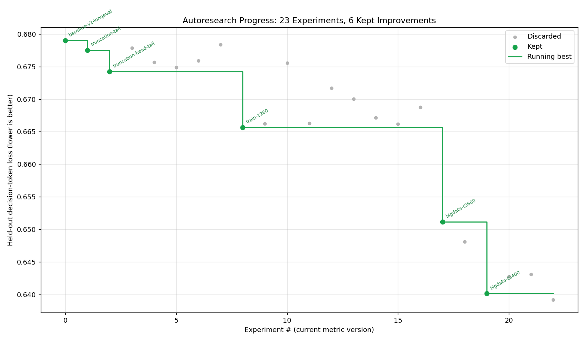

# longhorizon-autoresearch

Autonomous, karpathy/autoresearch-style self-improving training loop for
**agentic long-horizon SFT**, on a single RTX 4090.

The idea (after [@karpathy](https://github.com/karpathy/autoresearch)): give an
agent a small but real LLM-training setup and let it experiment on its own. It
proposes a change, trains for a fixed budget, checks if a held-out metric
improved, keeps or discards, and repeats. You come back to a log of experiments
and (hopefully) a better recipe.



## This is adaptive method-research, not a hyperparameter grid

Two principles drive every experiment:

1. **Adaptive, not pre-planned.** The next experiment is *derived from the
   accumulated results*, decided at the moment — not read off a fixed list. The
   reasoning behind each choice lives in [RESEARCH_LOG.md](RESEARCH_LOG.md).
2. **Change the training *method*, not just the knobs.** The goal is to adapt the
   training procedure to **long traces / long-horizon agentic tasks** — loss
   masking on the agent's own tokens, truncation that keeps the long-horizon
   payoff, position/late-token weighting, length curricula, goal re-anchoring,
   self-prediction auxiliaries. The menu and rationale are in [METHODS.md](METHODS.md).
   Hyperparameter tweaks are used only when the evidence specifically calls for one.

## This setup

- **Base model:** `Qwen3-4B-Instruct-2507`, 4-bit QLoRA.
- **Task:** SFT on a quality-filtered, long-horizon-weighted slice of multi-step
  agent×environment trajectories (`pilot_4090_longhorizon_v1`: 2730 train / 303 val).
- **Metric (lower is better):** held-out causal-LM loss on the agent's **decision
  tokens** (`<|assistant|>` spans only — the reasoning + tool-calls the agent
  itself emits), on data never trained on. We deliberately do *not* score the
  model on predicting tool-output / observation tokens (API JSON, file dumps):
  that is environment modelling, not the agentic skill, and it's the very thing
  that hid the most important method change. The metric is a **fixed yardstick**
  (always eval at 8192 ctx, head-truncated) so changing the training method never
  moves the goalposts. Full-sequence loss + per-bucket breakdown are reported too.
- **Compute budget:** a **fixed wall-clock** of ~22 min training + ~5 min eval per
  experiment (≤ 30 min). Fixed wall-clock (not fixed steps) is the karpathy
  framing: a method that improves throughput legitimately wins by fitting more
  optimizer steps into the same budget.
- **Search space:** primarily the **method levers** in [METHODS.md](METHODS.md)
  (loss masking, truncation strategy, position weighting, length curriculum, goal
  re-anchoring, self-prediction aux), with hyperparameters as a secondary lever.
  SFT/QLoRA — not RL; rollout-based RL can't fit a stable 30-min loop on one 4090.

## How it runs

`autoresearch/loop.py` pops experiment specs from `autoresearch/queue/` (a
race-free directory; the researcher drops the *next* spec in, derived from the
results so far — typically only one or two queued ahead, never a fixed plan),
builds each effective config as **running-best + this spec's overrides** (so
accepted improvements stack), trains+evals via `autoresearch/run_experiment.py`,
keeps it iff it beats the running-best decision loss, and records to
`experiments/ledger.jsonl`, `autoresearch/live.log`, `method.md`, `progress.png`,
and the human narrative in `RESEARCH_LOG.md`. State lives in files, so the loop is
fully resumable.

```bash
# on the GPU box (data + model live next to this repo)
nohup python autoresearch/loop.py \
    --data-root /home/ljj/ssd1/ljj/research/llm-longhorizon-traces \
    --model    /home/ljj/ssd1/ljj/research/llm-longhorizon-traces/models/Qwen3-4B-Instruct-2507 \
    --max-experiments 40 > autoresearch/loop.out 2>&1 &

tail -f autoresearch/live.log     # watch progress
```

See [EXPERIMENTS.md](EXPERIMENTS.md) for the running log and [method.md](method.md)
for the current best recipe.
